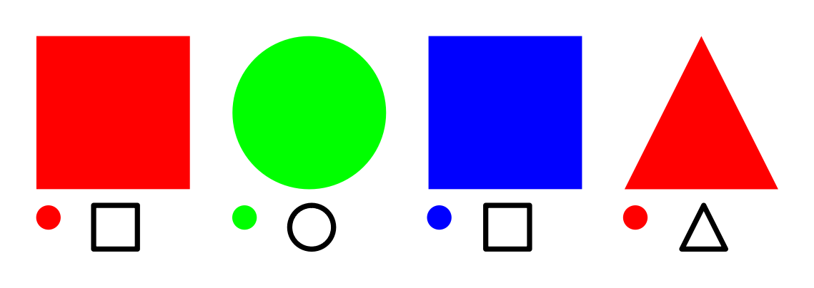
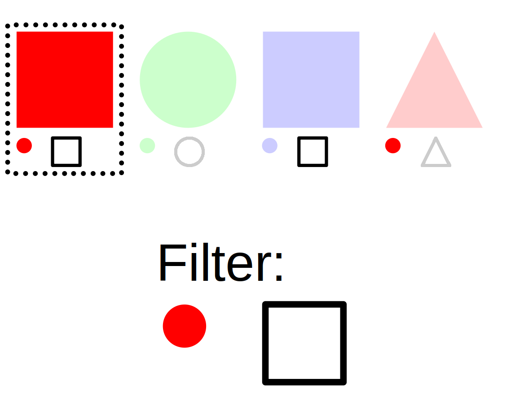

# RelationDB

A database wrapper providing an interface for working with taggable objects and relations.

## Dependencies

[This project uses ``poetry`` for dependency management.](./pyproject.toml)

## Goal

Tree structures are rather limiting, yet for practical reasons, they are being used everywhere (filesystems, shelves in real life). Tags allow us to describe every object we're keeping track of with a set of tags that then allow us to filter our objects by those same tags. Tags must be matched exactly, which allows for better reliability and predictability.

Relations allow us to describe how different objects are related to each other as well. Relations should be allowed to be directional, which is for example necessary for parent-child relations.

### Tag filtering

## Usage examples

- keeping track of documents
- keeping track of media
- a searchable contact book
- boorus
